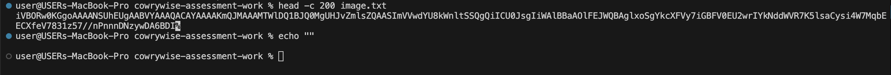

# Cowrywise Cybersecurity Assessment - Image Forensics Task

## Author
**Name:** Ijiola Abiodun  
**Email:** ijiolaabiodunusman@gmail.com  
**Role Applied:** Cybersecurity Internship
**Date:** October 2025  

---

## Overview
This task involves performing forensic analysis on a suspicious file named `image.txt`, provided as part of the Cowrywise Cybersecurity Internship assessment.  
The objective was to determine if any hidden or encoded information existed within the file and to recover any embedded data through structured forensic investigation.

My approach followed a simple workflow:  
1. **Identification** – Verify the file type and characteristics.  
2. **Extraction** – Use various tools to search for hidden or embedded content.  
3. **Analysis** – Inspect the extracted data for clues or patterns.  
4. **Reporting** – Summarize the findings clearly and reproducibly.  

---
**Operating System:** macOS 
**Terminal Environment:** zsh/bash  
**Working Directory:** `cowrywise-assessment-work`  

---

## Pre-Installation & Environment Setup

Before starting the investigation, I verified the availability of basic forensic tools on my system using the `which` command.

The following tools were checked for availability before starting the analysis:

| Tool | Description | Installed |
|------|--------------|------------|
| `file` | Identifies file type and MIME info |  `/usr/bin/file` |
| `strings` | Extracts readable text strings from binary data | ✅ `/usr/bin/strings` |
| `sha256sum` | Generates file checksums for verification | ❌ Not found |
| `steghide` | Performs steganographic extraction (hidden data in images) | ❌ Not found |
| `binwalk` | Analyzes binary files and extracts embedded objects | ❌ Not found |
| `exiftool` | Extracts metadata (EXIF) from images or media files | ❌ Not found |

### Tool Check Results


To ensure full forensic capabilities, the missing tools (`exiftool`, `binwalk`, `steghide`, and `sha256sum`) can be installed using **Homebrew**:

```bash
brew install exiftool binwalk steghide coreutils
```


After verifying the forensic tools using the `which` command, the following results were observed:

| Tool | Description | Installed |
|------|--------------|------------|
| `file` | Identifies file type and MIME info | ✅ `/usr/bin/file` |
| `strings` | Extracts readable text strings from binary data | ✅ `/usr/bin/strings` |
| `sha256sum` | Generates file checksums for verification | ✅ `/usr/local/bin/sha256sum` |
| `binwalk` | Analyzes binary files and extracts embedded objects | ✅ `/usr/local/bin/binwalk` |
| `exiftool` | Extracts metadata (EXIF) from images or media files | ✅ `/usr/local/bin/exiftool` |


---

## Project Structure Setup
After verifying the required tools, the next step was to organize the workspace into a clear forensic analysis structure.
This ensures all decoded files, scripts, and screenshots are neatly separated for traceability.

```bash
mkdir -p analysis scripts screenshots decoded_outputs
ls -la
```


---

## Project Structure Tree
The project directory is structured for clarity and reproducibility during forensic analysis.
Each folder serves a defined purpose from raw input data to decoded outputs and reports.
```
cowrywise-assessment-work/
├── README.md                     # Project documentation
├── image.txt                     # Provided assessment file (Base64 encoded)
├── analysis/                     # Stores forensic outputs (hashes, EXIF, strings, binwalk)
├── scripts/                      # Contains Python/Bash decoding scripts
├── screenshots/                  # Screenshots of command executions and results
├── decoded_outputs/              # Decoded image or extracted hidden data
└── image/                        # Image assets for README (tool checks, installations, etc.)
```
---

## File Inspection

The provided file for analysis was initially downloaded as a ZIP archive, extracted, and moved to the working directory as image.txt.
This file was suspected to contain hidden or encoded data, such as Base64 or steganographic content.

I verified the file’s presence and size using:

```bash
ls -lh image.txt
```

Next, I identified the file type using:

```bash
file image.txt
```

The output indicated that the file is a plain ASCII text file, likely containing a Base64-encoded image, given its continuous single-line content and lack of line terminators.

Finally, I checked the file size and byte count using:
```bash
du -h image.txt
wc -c image.txt
```


---

## File Integrity Generation  

To ensure the integrity of the provided file and detect any potential tampering, a SHA-256 hash was generated using the built-in shasum command on macOS.
This serves as a digital fingerprint for verifying that the file remains unmodified throughout the analysis.

```bash
shasum -a 256 image.txt > analysis/original_hash.txt

cat analysis/original_hash.txt
```


---

## Base64 Pattern Recognition
To inspect the structure of the image.txt file and confirm whether it contains encoded content, I examined the first 200 characters using the head command.
```bash
head -c 200 image.txt
echo ""
```



---

## Decoding the Base64 Content

A Python script `(scripts/decode_image.py)` was created to decode the Base64 data contained in `image.txt` and save it as a PNG image.

## Purpose

The objectives of this task are:

1. **Decode the Base64-encoded file** `image.txt` into a usable image format.
2. **Ensure file integrity** by verifying the size and content of the decoded image.
3. **Identify the file type** to confirm the successful decoding process.

```bash
chnod +x scripts/decode_image.py

python3 python3 scripts/decode_image.py
```


---